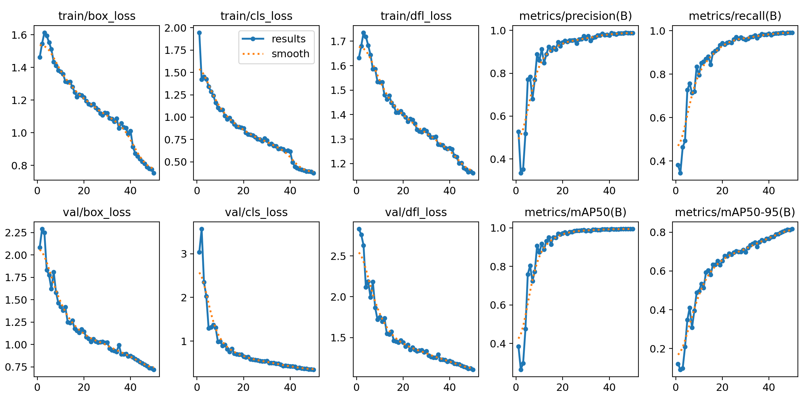
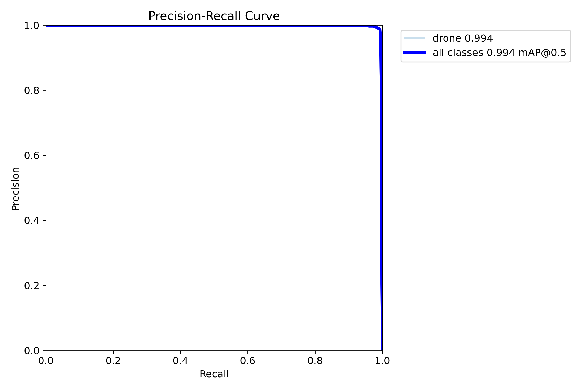

# ENHANCED AERIAL OBJECT DETECTION FOR AVIATION
**Capstone Research Project - IIIT Hyderabad (Winter 2025-26)**

## 🎯 Project Overview
This research focuses on developing a high-precision detection framework for Unmanned Aerial Vehicles (UAVs) to assist in airspace management and collision avoidance. By leveraging **YOLOv8s** and **Transfer Learning**, the model was optimized to detect small aerial targets across diverse backgrounds and lighting conditions.

## 📊 Technical Performance
The model was trained on **1,359 high-resolution images** over 50 epochs. Upon completion, it achieved professional-grade detection metrics:

| Metric | Accuracy | significance |
| :--- | :--- | :--- |
| **mAP50** | **99.4%** | Global detection reliability. |
| **Precision** | **98.9%** | Accuracy of positive detections. |
| **Recall** | **99.1%** | Consistency in identifying all targets. |

### Visual Validation
As shown in the performance curves below, the model demonstrated rapid convergence and high stability.

## 📂 Repository Architecture
* **/weights**: Contains `best.pt`, the final trained model "brain".
* **data.yaml**: Dataset configuration and class mapping.
* **confusion_matrix.png**: Detailed breakdown of classification accuracy.
* **results.png**: Comprehensive training loss and metric graphs.

## 🧠 Research Insights
The high Recall score (99.1%) is critical for aviation safety, ensuring that almost no aerial objects are missed by the system. The steady decline of the loss curves confirms the model's ability to generalize well to new data without overfitting.
